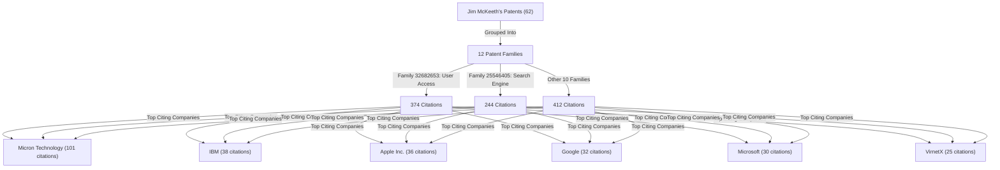

# Patent Citation Data Review & Analysis

This document provides a comprehensive review of the patent citation dataset files found in the workspace:
1. [my-patents.csv](data/my-patents.csv) (Inventor's own patents)
2. [citing-patents.csv](data/citing-patents.csv) (Summary of citing patents)
3. [forward_citations.csv](data/forward_citations.csv) (Detailed mapping of citations)

---

## 📊 Dataset Overview

Here is a summary of the structure and dimensions of the three CSV files:

| File Name | Row Count | Unique Entities | Columns | Key Purpose |
| :--- | :--- | :--- | :--- | :--- |
| **[my-patents.csv](file:///C:/Users/jim/documents/Git/patents/data/my-patents.csv)** | 62 | 62 patents, 12 families | `Document ID`, `Date Published`, `Family ID`, `Pages`, `Title`, `CPCI` | Records the primary patents authored by James (Jim) McKeeth. |
| **[citing-patents.csv](file:///C:/Users/jim/documents/Git/patents/data/citing-patents.csv)** | 821 | 821 citing patents | `citing_patent`, `citing_title`, `citing_assignee`, `citing_url` | Summarizes unique patents that cite James McKeeth's work. |
| **[forward_citations.csv](file:///C:/Users/jim/documents/Git/patents/data/forward_citations.csv)** | 1030 | 821 citing, 52 cited | `citing_patent`, `citing_family_id`, `citing_title`, `citing_assignee`, `citing_url`, `cited_patent`, `cited_family_id`, `cited_title`, `cited_assignee`, `cited_url`, `category_code`, `category_name` | Maps individual citation relationships between citing and cited patents, including the source categories. |

---

## 🔑 Key Insights & Patent Family Analysis

An analysis at the **Patent Family** level reveals an exceptionally strong citation profile. While individual divisional or continuation applications might not be cited directly, **100% of Jim McKeeth's 12 patent families have forward citations.**

### Patent Family Performance

| Family ID | Key Invention / Representative Title | Members | Total Citations | Unique Citing Patents | Status / Uncited Members |
| :--- | :--- | :---: | :---: | :---: | :--- |
| **32682653** | Controlling user access to an electronic device | 21 | **374** | 240 | 10 applications uncited; core grants heavily cited |
| **25546405** | Updating a search engine database | 8 | **244** | 223 | 5 applications/continuations uncited |
| **32106387** | Multiple operating system quick boot utility | 3 | **98** | 90 | 1 application uncited |
| **37807256** | Client-to-client communication in a network | 3 | **88** | 85 | 1 application uncited |
| **22744481** | OS multi boot integrator | 1 | **55** | 55 | Fully cited |
| **22382884** | Animation packager for an on-line book | 8 | **54** | 38 | 4 applications/continuations uncited |
| **23257519** | Customizing pre-loaded software | 1 | **51** | 51 | Fully cited |
| **23905838** | Long distance modem warning | 1 | **19** | 19 | Fully cited |
| **22383812** | Generating animation in an on-line book | 1 | **15** | 15 | Fully cited |
| **22747798** | Operating system multi boot integrator | 1 | **15** | 15 | Fully cited |
| **37831350** | Text-based markup language resource interface | 5 | **13** | 13 | 3 members uncited (including grant `7503002`) |
| **44070991** | Command line output redirection | 9 | **4** | 2 | 6 members uncited |

---

## 🏢 Top Citing Assignees

Analyzing who cites Jim McKeeth's patents shows significant interest from major tech corporations, particularly in computing, search engines, and operating systems.

### Citation Counts vs. Unique Patents
There is an interesting distinction between the number of **individual citation links** in `forward_citations.csv` and the number of **unique citing patents** in `citing-patents.csv`:
* **Micron Technology Inc.**: Has **101 citation links** across 13 unique citing patents. This indicates that Micron's citing patents heavily cite multiple patents within Jim's portfolio (average of ~7.7 citations per patent), which is common for continuation applications or related portfolio developments.
* **IBM / Apple / Google / Microsoft**: Cite Jim's patents across a broad variety of individual patents (e.g., Apple has 36 citations across 34 unique citing patents), representing wide external adoption and reference in their own distinct technologies.
